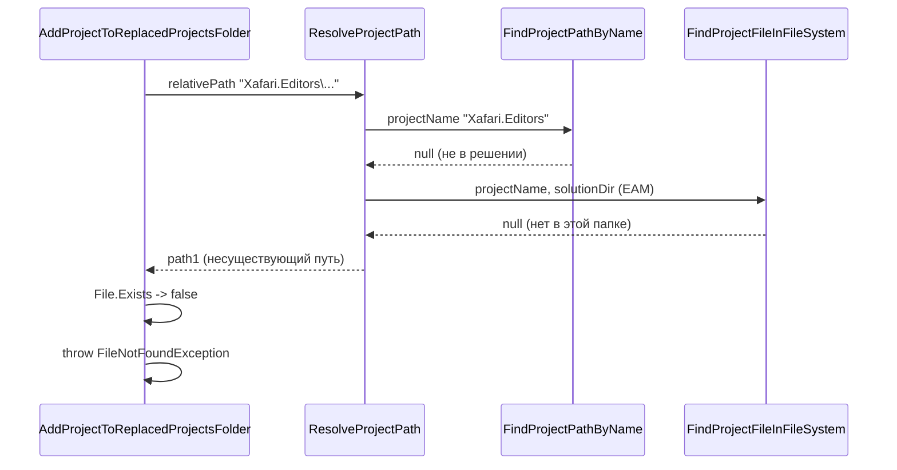

# Исправление FileNotFoundException при неразрешённой ссылке на проект

## Анализ лога [logs/app.log](logs/app.log)

**Сценарий:**

1. Обрабатывается проект `Xafari.BC.Settings`, в нём есть ссылка на `Xafari.Editors\Xafari.Editors.csproj`.
2. **FindProjectPathByName**: проект `Xafari.Editors` не найден в текущем решении (в решении открыто другое решение — EAM).
3. **FindProjectFileInFileSystem**: поиск идёт в `D:\galprj\XAFARI-20197\analysis\eam\Galaktika.EAM` (директория открытого решения); там 30 .csproj, но ни один не называется Xafari.Editors — проект, скорее всего, в другой ветке репозитория или в другом решении (xafari_x024).
4. **ResolveProjectPath** (строка 222–224 в [SolutionService.cs](src/NuGetToProjectReferenceConverter/Services/Solutions/SolutionService.cs)): при неудаче всех стратегий возвращает «первый вариант» — путь относительно текущего проекта:
  `...\Xafari.BC.Settings\Xafari.Editors\Xafari.Editors.csproj` (этого файла нет).
5. **AddProjectToReplacedProjectsFolder** вызывается с этим путём; проверка `File.Exists(projectPath)` (стр. 281–284) выбрасывает **FileNotFoundException**.

**Корневая причина:** при невозможности разрешить путь метод `ResolveProjectPath` всё равно возвращает сконструированный путь (`path1`), а вызывающий код не обрабатывает случай «путь не найден» и не проверяет существование перед рекурсивным вызовом.

---

## Анализ путей в D:\galprj\XAFARI-20197\analysis

Проверка реальной структуры каталогов и ссылок показывает:

| Что                             | Путь                                                                               |
| ------------------------------- | ---------------------------------------------------------------------------------- |
| Обрабатываемый проект           | `analysis\xafari_x024\Xafari\Xafari.BC.Settings\Xafari.BC.Settings.csproj`         |
| Ссылаемый проект Xafari.Editors | **Существует:** `analysis\xafari_x024\Xafari\Xafari.Editors\Xafari.Editors.csproj` |
| Открытое решение в логе         | `analysis\eam\Galaktika.EAM` (GetSolutionDirectory() возвращает именно его)        |
| Поиск в ФС в коде               | Только в `solutionDir` = `...\eam\Galaktika.EAM` → там проектов Xafari нет         |

**Вывод:** Xafari.Editors и Xafari.BC.Settings находятся в одной и той же родительской папке: `analysis\xafari_x024\Xafari\`. В .csproj ссылка задана как `$(SolutionDir)Xafari.Editors\Xafari.Editors.csproj` — то есть относительно **корня решения Xafari** (`...\xafari_x024\Xafari\`), а не открытого решения EAM. Поиск по имени в файловой системе идёт только от директории **открытого** решения (Galaktika.EAM), поэтому проект по имени не находится, хотя он есть на диске в дереве рядом с обрабатываемым проектом.

**Следствие:** Ограничиваться только «не возвращать путь и пропускать» (Вариант 1) в данной конфигурации **не оптимально** — ссылка в действительности разрешима, если расширить область поиска: искать по имени не только в `solutionDir`, но и в директории текущего проекта и её родителях (например, родитель `basePath` — это как раз `...\xafari_x024\Xafari\`, где лежит Xafari.Editors).

---

## Варианты решения

### Вариант 1 (рекомендуемый): Не возвращать путь при неудаче и пропускать неразрешённые ссылки

**Идея:** Считать «путь не найден» нормальной ситуацией (внешний/NuGet/отсутствующий проект) и не доводить до исключения.

**Изменения:**

1. **ResolveProjectPath** ([SolutionService.cs](src/NuGetToProjectReferenceConverter/Services/Solutions/SolutionService.cs), строки 220–224):
  - Вместо возврата `path1` при неудаче всех стратегий возвращать `**null**`.
  - Лог оставить: «Путь не найден ни одним способом, возвращаем null».
2. **AddProjectToReplacedProjectsFolder** (строки 316–325):
  - После вызова `ResolveProjectPath` проверять результат:
    - если `subProjectAbsolutePath == null` **или** `!File.Exists(subProjectAbsolutePath)` — логировать предупреждение (например, «Ссылка на проект X не разрешена / файл не найден, пропускаем») и **continue** по циклу ссылок, **не вызывать** `AddProjectToReplacedProjectsFolder` рекурсивно.

**Плюсы:** Минимальные изменения, предсказуемое поведение: неразрешённые ссылки пропускаются, обработка остальных проектов продолжается.  
**Минусы:** Ссылки на отсутствующие проекты молча не попадут в папку заменённых (но это уже сейчас невозможно без падения).

---

### Вариант 2: Только проверка в вызывающем коде (без изменения контракта ResolveProjectPath)

**Идея:** Не менять возвращаемое значение `ResolveProjectPath`, но в цикле по ссылкам перед рекурсией проверять существование файла.

**Изменения:**

- В **AddProjectToReplacedProjectsFolder** после строки 322:
  - Если `!File.Exists(subProjectAbsolutePath)` — логировать предупреждение и **continue** (не вызывать `AddProjectToReplacedProjectsFolder`).

**Плюсы:** Очень мало правок, исключение исчезнет.  
**Минусы:** В логах по-прежнему будет сообщение «возвращаем первый вариант» для несуществующего пути; семантика «возвращаем путь, который может не существовать» остаётся, что путает при отладке.

---

### Вариант 3: Расширить область поиска в файловой системе

**Идея:** Увеличить шанс найти проект по имени, если он лежит не в директории открытого решения, а рядом с обрабатываемым проектом (другое решение/репозиторий).

**Изменения (дополнительно к Варианту 1 или 2):**

- В **FindProjectFileInFileSystem** (или в **ResolveProjectPath**) добавить ещё одну стратегию поиска по имени:
  - Искать не только в `solutionDir`, но и, например, в директории текущего проекта `basePath` и в родительских каталогах (например, подняться на 2–5 уровней от `basePath` и в каждом искать `*.csproj` по имени).
- Либо вызывать поиск по файловой системе с двумя корнями: `solutionDir` и каталог, полученный из `basePath` (например, общий корень репозитория).

**Плюсы:** Может найти Xafari.Editors, если он есть где-то в дереве рядом с Xafari.BC.Settings.  
**Минусы:** Сложнее, возможны ложные срабатывания при одинаковых именах проектов в разных ветках; нужно ограничить глубину/объём сканирования.

---

### Вариант 4: Пользовательская настройка или интерактивное поведение

**Идея:** При неразрешённой ссылке не падать и не молча пропускать, а дать пользователю выбор.

**Возможные реализации:**

- В настройках: «При неразрешённой ссылке: Пропустить / Прервать с ошибкой».
- Диалог: «Ссылка на X не найдена. Пропустить / Указать путь вручную / Отмена».

**Плюсы:** Гибкость.  
**Минусы:** Требует доработки UI/настроек и усложняет сценарий автоматической конвертации.

---

## Рекомендация (с учётом анализа путей)

- **Приоритет 1 — расширить поиск (Вариант 3):** Добавить поиск по имени в файловой системе не только от `solutionDir`, но и от **родительской директории текущего проекта** (`basePath`). При обработке `...\xafari_x024\Xafari\Xafari.BC.Settings\...` в качестве корня поиска использовать `...\xafari_x024\Xafari\` — тогда Xafari.Editors будет найден. Реализация: в `ResolveProjectPath` перед шагом 6 вызывать `FindProjectFileInFileSystem(projectName, Path.GetDirectoryName(basePath))` (и при необходимости подниматься на 1–2 уровня вверх), либо расширить `FindProjectFileInFileSystem` для приёма нескольких корневых директорий.
- **Приоритет 2 — защита от падения (Вариант 1):** Если после расширенного поиска путь всё равно не найден — возвращать `null` и в вызывающем коде пропускать ссылку с предупреждением в логе (не вызывать `AddProjectToReplacedProjectsFolder` и не бросать исключение). Это покрывает случаи действительно отсутствующих или внешних проектов.
- Итого: **не лучше** ограничиваться только «не возвращать путь и пропускать» — в сценарии из лога проект существует, и его можно найти за счёт расширения области поиска. Оптимально: сначала расширить поиск (Вариант 3), затем оставить возврат `null` и пропуск как запасной вариант (Вариант 1).

