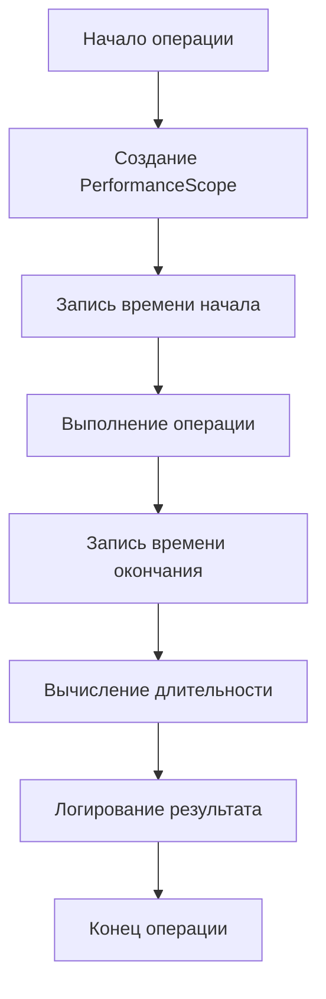

# План добавления логирования производительности

## Обзор

Решение работает, но медленно. Необходимо добавить логирование с замерами скорости работы в ключевые части приложения для выявления узких мест.

---

## Потенциальные узкие места

### 1. Поиск файлов в файловой системе
**Метод:** [`FindProjectFileInFileSystem`](src/NuGetToProjectReferenceConverter/Services/Solutions/SolutionService.cs:122)

**Проблема:** 
- `Directory.GetFiles(searchDir, "*.csproj", SearchOption.AllDirectories)` выполняет рекурсивный поиск
- Поиск выполняется в нескольких директориях
- Каждая директория может содержать сотни файлов

### 2. Рекурсивная обработка проектов
**Метод:** [`AddProjectToReplacedProjectsFolder`](src/NuGetToProjectReferenceConverter/Services/Solutions/SolutionService.cs:309)

**Проблема:**
- Рекурсивно обрабатывает все проекты и их зависимости
- Для каждого проекта загружается MSBuild проект
- Каждая ссылка на проект вызывает новый поиск

### 3. Логирование
**Метод:** [`FileLogger.Log`](src/NuGetToProjectReferenceConverter/Tools/FileLogger.cs:33)

**Проблема:**
- Каждое логирование записывает в файл
- Блокировка (`lock`) при каждом вызове
- Большое количество записей может замедлить работу

### 4. Поиск проектов в решении
**Метод:** [`FindProjectPathByName`](src/NuGetToProjectReferenceConverter/Services/Solutions/SolutionService.cs:86)

**Проблема:**
- Перебирает все проекты в решении
- Выполняется для каждой ссылки на проект

---

## План реализации

### Шаг 1: Создать класс PerformanceLogger

**Файл:** `src/NuGetToProjectReferenceConverter/Tools/PerformanceLogger.cs`

**Назначение:** Класс для измерения времени выполнения операций с автоматическим логированием.

**Функциональность:**
- Измерение времени выполнения операций
- Автоматическое логирование результатов
- Поддержка вложенных операций
- Статистика по операциям

### Шаг 2: Добавить замеры времени в SolutionService

**Методы для инструментирования:**

1. **AddProjectToReplacedProjectsFolder** - измерить общее время обработки проекта
2. **FindProjectFileInFileSystem** - измерить время поиска в каждой директории
3. **FindProjectPathByName** - измерить время поиска в решении
4. **ResolveProjectPath** - измерить время разрешения пути
5. **GetAllProjects** - измерить время получения всех проектов

### Шаг 3: Оптимизировать логирование

**Оптимизации:**
- Добавить буферизацию логов
- Уменьшить количество записей в файл
- Добавить уровни логирования (Debug, Info, Warning, Error)

### Шаг 4: Анализ результатов

**После тестирования:**
- Проанализировать логи производительности
- Выявить самые медленные операции
- Предложить оптимизации

---

## Диаграмма процесса измерения производительности

---

## Ожидаемые результаты

После добавления логирования производительности:

1. Будет видно, какие операции занимают больше всего времени
2. Можно будет определить узкие места
3. Можно будет принять решение об оптимизации

---

## Возможные оптимизации

### Вариант 1: Кэширование списка файлов

**Идея:** Кэшировать список всех файлов .csproj в каждой директории.

**Преимущества:**
- Поиск выполняется только один раз для каждой директории
- Повторные запросы мгновенные

**Недостатки:**
- Требует больше памяти
- Нужно инвалидировать кэш при изменении файловой системы

### Вариант 2: Параллельный поиск

**Идея:** Искать файлы в нескольких директориях параллельно.

**Преимущества:**
- Быстрее при поиске в нескольких директориях

**Недостатки:**
- Усложняет код
- Может увеличить нагрузку на диск

### Вариант 3: Оптимизация логирования

**Идея:** Буферизировать логи и записывать их пакетами.

**Преимущества:**
- Меньше операций записи на диск
- Меньше блокировок

**Недостатки:**
- Потеря логов при сбое
- Задержка в появлении логов

### Вариант 4: Предварительный индекс

**Идея:** Создать индекс всех проектов в начале работы.

**Преимущества:**
- Мгновенный поиск проектов
- Не нужно сканировать файловую систему

**Недостатки:**
- Требует времени на создание индекса
- Требует больше памяти

---

## Порядок выполнения

1. Создать класс `PerformanceLogger`
2. Добавить замеры времени в `SolutionService`
3. Протестировать и собрать статистику
4. Проанализировать результаты
5. Выбрать и реализовать оптимизации