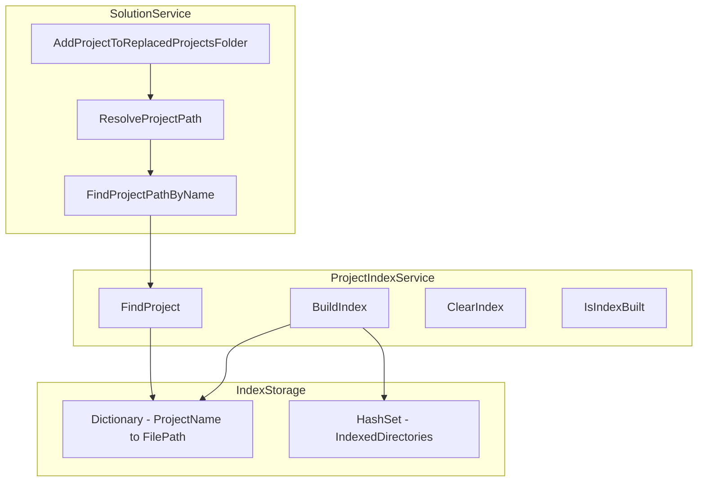

# Вариант 2: Предварительное индексирование всех проектов
## Подробный план реализации

## Обзор

Вариант 2 предполагает создание индекса всех проектов в файловой системе при запуске конвертера. Это позволит мгновенно находить проекты по имени без повторного сканирования директорий.

## Архитектура



## Структура файлов

```
src/NuGetToProjectReferenceConverter/
├── Services/
│   ├── Solutions/
│   │   ├── ISolutionService.cs
│   │   └── SolutionService.cs
│   └── Indexing/
│       ├── IProjectIndexService.cs
│       └── ProjectIndexService.cs
└── Tools/
    ├── FileLogger.cs
    └── PerformanceLogger.cs
```

## Этапы реализации

### Этап 1: Создание интерфейса IProjectIndexService

**Файл:** `src/NuGetToProjectReferenceConverter/Services/Indexing/IProjectIndexService.cs`

```csharp
using System;
using System.Collections.Generic;

namespace NuGetToProjectReferenceConverter.Services.Indexing
{
    /// <summary>
    /// Сервис для индексирования проектов в файловой системе
    /// </summary>
    public interface IProjectIndexService
    {
        /// <summary>
        /// Строит индекс всех проектов в указанной директории
        /// </summary>
        /// <param name="rootDirectory">Корневая директория для индексирования</param>
        void BuildIndex(string rootDirectory);
        
        /// <summary>
        /// Находит путь к проекту по имени
        /// </summary>
        /// <param name="projectName">Имя проекта (без расширения)</param>
        /// <returns>Полный путь к файлу проекта или null, если не найден</returns>
        string FindProject(string projectName);
        
        /// <summary>
        /// Проверяет, был ли построен индекс
        /// </summary>
        bool IsIndexBuilt { get; }
        
        /// <summary>
        /// Очищает индекс
        /// </summary>
        void ClearIndex();
        
        /// <summary>
        /// Получает статистику индекса
        /// </summary>
        ProjectIndexStats GetStats();
    }
    
    /// <summary>
    /// Статистика индекса проектов
    /// </summary>
    public class ProjectIndexStats
    {
        public int TotalProjects { get; set; }
        public int IndexedDirectories { get; set; }
        public TimeSpan BuildTime { get; set; }
        public string RootDirectory { get; set; }
    }
}
```

### Этап 2: Реализация ProjectIndexService

**Файл:** `src/NuGetToProjectReferenceConverter/Services/Indexing/ProjectIndexService.cs`

```csharp
using System;
using System.Collections.Generic;
using System.Diagnostics;
using System.IO;
using System.Linq;
using NuGetToProjectReferenceConverter.Tools;

namespace NuGetToProjectReferenceConverter.Services.Indexing
{
    /// <summary>
    /// Сервис для индексирования проектов в файловой системе
    /// </summary>
    public class ProjectIndexService : IProjectIndexService
    {
        // Индекс: имя проекта -> полный путь к файлу
        private readonly Dictionary<string, string> _projectIndex;
        
        // Множество проиндексированных директорий
        private readonly HashSet<string> _indexedDirectories;
        
        // Корневая директория индексирования
        private string _rootDirectory;
        
        // Время построения индекса
        private TimeSpan _buildTime;
        
        // Флаг, указывающий, был ли построен индекс
        private bool _isIndexBuilt;
        
        // Объект для синхронизации доступа к индексу
        private readonly object _lock = new object();
        
        public ProjectIndexService()
        {
            _projectIndex = new Dictionary<string, string>(StringComparer.OrdinalIgnoreCase);
            _indexedDirectories = new HashSet<string>(StringComparer.OrdinalIgnoreCase);
            _isIndexBuilt = false;
        }
        
        /// <summary>
        /// Строит индекс всех проектов в указанной директории
        /// </summary>
        public void BuildIndex(string rootDirectory)
        {
            if (string.IsNullOrWhiteSpace(rootDirectory))
                throw new ArgumentException("Корневая директория не может быть пустой", nameof(rootDirectory));
            
            if (!Directory.Exists(rootDirectory))
                throw new DirectoryNotFoundException($"Директория не найдена: {rootDirectory}");
            
            lock (_lock)
            {
                // Очищаем предыдущий индекс
                ClearIndex();
                
                _rootDirectory = rootDirectory;
                
                var stopwatch = Stopwatch.StartNew();
                
                FileLogger.Log($"ProjectIndexService: Начало построения индекса в директории: {rootDirectory}");
                
                try
                {
                    // Рекурсивно ищем все .csproj файлы
                    var projectFiles = Directory.GetFiles(
                        rootDirectory, 
                        "*.csproj", 
                        SearchOption.AllDirectories
                    );
                    
                    FileLogger.Log($"ProjectIndexService: Найдено {projectFiles.Length} файлов .csproj");
                    
                    // Добавляем каждый проект в индекс
                    int duplicateCount = 0;
                    foreach (var projectFile in projectFiles)
                    {
                        var projectName = Path.GetFileNameWithoutExtension(projectFile);
                        
                        // Если проект с таким именем уже есть, логируем дубликат
                        if (_projectIndex.ContainsKey(projectName))
                        {
                            duplicateCount++;
                            FileLogger.Log($"ProjectIndexService: Дубликат проекта: {projectName} -> {_projectIndex[projectName]} и {projectFile}");
                        }
                        else
                        {
                            _projectIndex[projectName] = projectFile;
                        }
                        
                        // Запоминаем директорию проекта
                        var projectDir = Path.GetDirectoryName(projectFile);
                        _indexedDirectories.Add(projectDir);
                    }
                    
                    if (duplicateCount > 0)
                    {
                        FileLogger.Log($"ProjectIndexService: Обнаружено {duplicateCount} дубликатов имен проектов");
                    }
                    
                    stopwatch.Stop();
                    _buildTime = stopwatch.Elapsed;
                    _isIndexBuilt = true;
                    
                    FileLogger.Log($"ProjectIndexService: Индекс построен за {_buildTime.TotalMilliseconds:F2} мс");
                    FileLogger.Log($"ProjectIndexService: Всего проектов в индексе: {_projectIndex.Count}");
                    FileLogger.Log($"ProjectIndexService: Проиндексировано директорий: {_indexedDirectories.Count}");
                }
                catch (Exception ex)
                {
                    FileLogger.Log($"ProjectIndexService: Ошибка при построении индекса: {ex.Message}");
                    ClearIndex();
                    throw;
                }
            }
        }
        
        /// <summary>
        /// Находит путь к проекту по имени
        /// </summary>
        public string FindProject(string projectName)
        {
            if (string.IsNullOrWhiteSpace(projectName))
                return null;
            
            lock (_lock)
            {
                if (!_isIndexBuilt)
                {
                    FileLogger.Log($"ProjectIndexService: Попытка поиска до построения индекса");
                    return null;
                }
                
                if (_projectIndex.TryGetValue(projectName, out var projectPath))
                {
                    FileLogger.Log($"ProjectIndexService: Проект найден в индексе: {projectName} -> {projectPath}");
                    return projectPath;
                }
                
                FileLogger.Log($"ProjectIndexService: Проект не найден в индексе: {projectName}");
                return null;
            }
        }
        
        /// <summary>
        /// Проверяет, был ли построен индекс
        /// </summary>
        public bool IsIndexBuilt
        {
            get
            {
                lock (_lock)
                {
                    return _isIndexBuilt;
                }
            }
        }
        
        /// <summary>
        /// Очищает индекс
        /// </summary>
        public void ClearIndex()
        {
            lock (_lock)
            {
                _projectIndex.Clear();
                _indexedDirectories.Clear();
                _rootDirectory = null;
                _buildTime = TimeSpan.Zero;
                _isIndexBuilt = false;
                
                FileLogger.Log("ProjectIndexService: Индекс очищен");
            }
        }
        
        /// <summary>
        /// Получает статистику индекса
        /// </summary>
        public ProjectIndexStats GetStats()
        {
            lock (_lock)
            {
                return new ProjectIndexStats
                {
                    TotalProjects = _projectIndex.Count,
                    IndexedDirectories = _indexedDirectories.Count,
                    BuildTime = _buildTime,
                    RootDirectory = _rootDirectory
                };
            }
        }
    }
}
```

### Этап 3: Интеграция с SolutionService

**Изменения в файле:** `src/NuGetToProjectReferenceConverter/Services/Solutions/SolutionService.cs`

#### 3.1. Добавить поле для ProjectIndexService

```csharp
private readonly IProjectIndexService _projectIndexService;
```

#### 3.2. Обновить конструктор

```csharp
public SolutionService(IPathService pathService, IProjectIndexService projectIndexService)
{
    _pathService = pathService ?? throw new ArgumentNullException(nameof(pathService));
    _projectIndexService = projectIndexService ?? throw new ArgumentNullException(nameof(projectIndexService));
}
```

#### 3.3. Добавить метод для инициализации индекса

```csharp
/// <summary>
/// Инициализирует индекс проектов перед началом работы
/// </summary>
public void InitializeProjectIndex(string rootDirectory)
{
    if (string.IsNullOrWhiteSpace(rootDirectory))
        throw new ArgumentException("Корневая директория не может быть пустой", nameof(rootDirectory));
    
    FileLogger.Log($"SolutionService: Инициализация индекса проектов в директории: {rootDirectory}");
    
    using (var perf = PerformanceLogger.Measure("InitializeProjectIndex"))
    {
        _projectIndexService.BuildIndex(rootDirectory);
        
        var stats = _projectIndexService.GetStats();
        FileLogger.Log($"SolutionService: Индекс инициализирован: {stats.TotalProjects} проектов, {stats.IndexedDirectories} директорий, время: {stats.BuildTime.TotalMilliseconds:F2} мс");
    }
}
```

#### 3.4. Обновить метод FindProjectPathByName

```csharp
private string FindProjectPathByName(string projectName)
{
    using (var perf = PerformanceLogger.Measure($"FindProjectPathByName({projectName})"))
    {
        // Сначала проверяем индекс
        if (_projectIndexService.IsIndexBuilt)
        {
            var indexedPath = _projectIndexService.FindProject(projectName);
            if (indexedPath != null)
            {
                FileLogger.Log($"SolutionService.FindProjectPathByName: Проект найден в индексе: {projectName} -> {indexedPath}");
                return indexedPath;
            }
        }
        
        // Если индекс не построен или проект не найден, используем старый метод
        FileLogger.Log($"SolutionService.FindProjectPathByName: Проект не найден в индексе, поиск в решении: {projectName}");
        
        var project = _solution.Projects
            .FirstOrDefault(p => p.Name.Equals(projectName, StringComparison.OrdinalIgnoreCase));
        
        if (project != null)
        {
            var projectPath = project.FullName;
            FileLogger.Log($"SolutionService.FindProjectPathByName: Проект найден по имени в решении: {projectName} -> {projectPath}");
            return projectPath;
        }
        
        FileLogger.Log($"SolutionService.FindProjectPathByName: Проект не найден по имени: {projectName}");
        return null;
    }
}
```

#### 3.5. Обновить метод ResolveProjectPath

```csharp
private string ResolveProjectPath(string projectName, string solutionDir, string currentProjectDir = null)
{
    using (var perf = PerformanceLogger.Measure($"ResolveProjectPath({projectName})"))
    {
        // Сначала проверяем индекс
        if (_projectIndexService.IsIndexBuilt)
        {
            var indexedPath = _projectIndexService.FindProject(projectName);
            if (indexedPath != null)
            {
                FileLogger.Log($"SolutionService.ResolveProjectPath: Путь найден в индексе: {projectName} -> {indexedPath}");
                return indexedPath;
            }
        }
        
        // Если индекс не построен или проект не найден, используем старый метод
        FileLogger.Log($"SolutionService.ResolveProjectPath: Проект не найден в индексе, поиск в файловой системе: {projectName}");
        
        var foundPathInFs = FindProjectFileInFileSystem(projectName, solutionDir, currentProjectDir);
        if (foundPathInFs != null)
        {
            FileLogger.Log($"SolutionService.ResolveProjectPath: Путь найден по имени в файловой системе: {projectName} -> {foundPathInFs}");
            return foundPathInFs;
        }
        
        FileLogger.Log($"SolutionService.ResolveProjectPath: Путь не найден для проекта: {projectName}");
        return null;
    }
}
```

### Этап 4: Обновление NuGetToProjectReferenceConverterPackage

**Изменения в файле:** `src/NuGetToProjectReferenceConverter/NuGetToProjectReferenceConverterPackage.cs`

#### 4.1. Добавить регистрацию ProjectIndexService

```csharp
protected override void Initialize()
{
    base.Initialize();
    
    // Регистрация сервисов
    var pathService = new PathService();
    var projectIndexService = new ProjectIndexService();
    var solutionService = new SolutionService(pathService, projectIndexService);
    
    // Сохраняем сервисы для использования
    _solutionService = solutionService;
    _projectIndexService = projectIndexService;
}
```

#### 4.2. Инициализировать индекс перед началом работы

```csharp
private void MenuItemCallback(object sender, EventArgs e)
{
    try
    {
        // Получаем текущее решение
        var dte = (DTE)GetService(typeof(DTE));
        if (dte?.Solution == null || string.IsNullOrEmpty(dte.Solution.FullName))
        {
            MessageBox.Show("Откройте решение перед использованием конвертера.");
            return;
        }
        
        var solutionPath = dte.Solution.FullName;
        var solutionDir = Path.GetDirectoryName(solutionPath);
        
        // Инициализируем индекс проектов
        // Используем родительскую директорию решения как корневую для индексирования
        var rootDirectory = Path.GetDirectoryName(solutionDir);
        _solutionService.InitializeProjectIndex(rootDirectory);
        
        // Выполняем конвертацию
        _solutionService.ConvertNuGetToProjectReferences(solutionPath);
        
        MessageBox.Show("Конвертация завершена успешно!");
    }
    catch (Exception ex)
    {
        MessageBox.Show($"Ошибка при конвертации: {ex.Message}");
    }
}
```

### Этап 5: Добавление в проект

**Изменения в файле:** `src/NuGetToProjectReferenceConverter/NuGetToProjectReferenceConverter.csproj`

```xml
<ItemGroup>
  <Compile Include="Services\Indexing\IProjectIndexService.cs" />
  <Compile Include="Services\Indexing\ProjectIndexService.cs" />
</ItemGroup>
```

## План тестирования

### Тест 1: Проверка построения индекса

1. Запустить конвертер с решением
2. Проверить логи на наличие сообщения о построении индекса
3. Убедиться, что время построения индекса логируется
4. Проверить статистику индекса (количество проектов, директорий)

### Тест 2: Проверка поиска проектов

1. Запустить конвертер с решением
2. Проверить логи на наличие сообщений о поиске проектов в индексе
3. Убедиться, что время поиска проектов значительно уменьшилось (<1 мс)

### Тест 3: Проверка обработки дубликатов

1. Создать решение с проектами, имеющими одинаковые имена
2. Запустить конвертер
3. Проверить логи на наличие сообщений о дубликатах
4. Убедиться, что конвертер корректно обрабатывает дубликаты

### Тест 4: Сравнение производительности

1. Замерить время работы конвертера без индекса
2. Замерить время работы конвертера с индексом
3. Сравнить результаты и убедиться в улучшении производительности

## Ожидаемые результаты

### До оптимизации:
- Поиск одного проекта: 1-5 секунд
- Общее время работы: 5-10 минут
- Сканирование директории analysis: 1-4.5 секунды (20+ раз)

### После оптимизации:
- Построение индекса: 5-10 секунд (однократно)
- Поиск одного проекта: <1 мс
- Общее время работы: 30-60 секунд
- Сканирование директории analysis: 0 секунд (используется индекс)

### Улучшение производительности:
- Поиск проектов: в 1000-5000 раз быстрее
- Общее время работы: в 10-20 раз быстрее

## Возможные проблемы и решения

### Проблема 1: Дубликаты имен проектов

**Описание:** В файловой системе могут быть проекты с одинаковыми именами в разных директориях.

**Решение:** 
- Логировать все дубликаты
- Использовать первый найденный проект
- Предусмотреть возможность настройки приоритета директорий

### Проблема 2: Большое потребление памяти

**Описание:** При большом количестве проектов индекс может занимать много памяти.

**Решение:**
- Использовать `StringComparer.OrdinalIgnoreCase` для оптимизации памяти
- Рассмотреть возможность использования слабых ссылок
- Добавить ограничение на размер индекса

### Проблема 3: Изменение файловой системы

**Описание:** Если файловая система изменяется после построения индекса, индекс становится устаревшим.

**Решение:**
- Добавить возможность пересборки индекса
- Рассмотреть использование FileSystemWatcher для отслеживания изменений
- Добавить проверку существования файлов перед использованием

### Проблема 4: Медленное первоначальное индексирование

**Описание:** Построение индекса может занять время при большом количестве проектов.

**Решение:**
- Показывать прогресс построения индекса
- Рассмотреть возможность асинхронного построения индекса
- Добавить кэширование индекса на диск

## Дальнейшие улучшения

### Улучшение 1: Кэширование индекса на диск

Сохранять индекс в файл для быстрой загрузки при следующем запуске.

### Улучшение 2: Инкрементальное обновление индекса

Обновлять только измененные директории вместо полной пересборки.

### Улучшение 3: Приоритет директорий

Добавить возможность настройки приоритета директорий для разрешения конфликтов имен.

### Улучшение 4: Поддержка нескольких типов проектов

Расширить индекс для поддержки других типов проектов (.vbproj, .fsproj и т.д.).