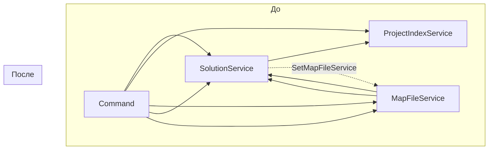

# План упрощения кода SolutionService

## Контекст

После анализа лога выяснилось, что все пути в `ProjectReference` уже являются абсолютными. Это означает, что сложная логика разрешения путей в методе `ResolveProjectPath` не используется.

## Анализ зависимостей

### Что ОСТАЁТСЯ (нужно для основного функционала)

**`IMapFileService` / `MapFileService`**:
- Используется в [`NuGetToProjectReferenceConverter`](src/NuGetToProjectReferenceConverter/NuGetToProjectReferenceConverter.cs:20) для поиска пути проекта по ID пакета
- Использует `ISolutionService.GetSolutionDirectory()` для определения пути к файлу карты
- **Решение**: Оставить, но убрать циклическую зависимость

### Что УДАЛЯЕТСЯ (не используется)

**`IProjectIndexService` / `ProjectIndexService`**:
- Используется только в `SolutionService.ResolveProjectPath` (шаг 6)
- **Решение**: Удалить полностью

**Циклическая зависимость `SolutionService` ↔ `MapFileService`**:
- `SolutionService` использует `_mapFileService` только в `ResolveProjectPath` (шаг 4)
- `MapFileService` использует `_solutionService.GetSolutionDirectory()`
- **Решение**: Убрать `_mapFileService` из `SolutionService`

## Анализ неактуального кода в SolutionService

### Метод `ResolveProjectPath` (строки 289-379)
- **Текущая логика**: 8 стратегий разрешения пути
- **Фактическое использование**: Только проверка `Path.IsPathRooted` (шаг 1)
- **Решение**: Упростить до простой проверки существования файла

### Метод `FindProjectPathByName` (строки 131-171)
- **Используется только в**: `ResolveProjectPath` (шаг 6)
- **Решение**: Удалить

### Метод `FindProjectFileInFileSystem` (строки 184-277)
- **Используется только в**: `ResolveProjectPath` (шаг 7)
- **Решение**: Удалить

### Поле `_projectCache` (строка 29)
- **Используется только в**: `FindProjectFileInFileSystem`
- **Решение**: Удалить

### Поле `_projectIndexService` (строка 26)
- **Используется в**: `InitializeProjectIndex`, `FindProjectPathByName`, `ResolveProjectPath`
- **Решение**: Удалить

### Поле `_mapFileService` (строка 27)
- **Используется в**: `ResolveProjectPath` (шаг 4)
- **Решение**: Удалить

### Метод `SetMapFileService` (строки 53-56)
- **Используется для**: разрешения циклической зависимости
- **Решение**: Удалить

### Метод `InitializeProjectIndex` (строки 106-123)
- **В интерфейсе**: Да (`ISolutionService.InitializeProjectIndex`)
- **Используется в**: `Command.cs` (строка 130)
- **Решение**: Удалить из интерфейса и реализации

## План изменений

### 1. SolutionService.cs

**Удалить:**
- `using NuGetToProjectReferenceConverter.Services.Indexing;`
- `using NuGetToProjectReferenceConverter.Services.MapFile;`
- поле `_projectIndexService`
- поле `_mapFileService`
- поле `_projectCache`
- метод `SetMapFileService`
- метод `InitializeProjectIndex`
- метод `FindProjectPathByName`
- метод `FindProjectFileInFileSystem`
- метод `ResolveProjectPath` (заменить на упрощённую версию)

**Изменить конструктор:**
```csharp
public SolutionService(IServiceProvider serviceProvider, IPathService pathService)
{
    _serviceProvider = serviceProvider ?? throw new ArgumentNullException(nameof(serviceProvider));
    _pathService = pathService ?? throw new ArgumentNullException(nameof(pathService));
}
```

**Упростить `AddProjectToReplacedProjectsFolder`:**
Заменить вызов `ResolveProjectPath` на простую проверку:
```csharp
string subProjectAbsolutePath = item.EvaluatedInclude;
if (!File.Exists(subProjectAbsolutePath))
{
    continue; // или throw new FileNotFoundException
}
```

### 2. ISolutionService.cs

**Удалить:**
- метод `InitializeProjectIndex`

### 3. Command.cs

**Удалить:**
- `using NuGetToProjectReferenceConverter.Services.Indexing;`
- создание `projectIndexService`
- вызов `solutionService.SetMapFileService(mapFileService)`
- вызов `solutionService.InitializeProjectIndex(rootDirectory)`

**Изменить порядок создания сервисов:**
```csharp
IPathService pathService = new PathService();
ISolutionService solutionService = new SolutionService((IServiceProvider)ServiceProvider, pathService);
IMapFileService mapFileService = new MapFileService(solutionService, pathService);

var replaceNuGetWithProjectReference = new NuGetToProjectReferenceConverter(solutionService,
    mapFileService, pathService);
```

### 4. Удалить файлы

После проверки компиляции удалить:
- `Services/Indexing/IProjectIndexService.cs`
- `Services/Indexing/ProjectIndexService.cs`

## Итоговая структура SolutionService

```csharp
public class SolutionService : ISolutionService
{
    private const string ReplacedProjectsFolderName = "!ReplacedProjects";
    private readonly IServiceProvider _serviceProvider;
    private readonly IPathService _pathService;
    private ReplacedProjectsFolderItem _replacedProjectsFolder = null;

    public SolutionService(IServiceProvider serviceProvider, IPathService pathService)
    { ... }

    public IEnumerable<EnvDTE.Project> GetAllProjects()
    { ... }

    private IEnumerable<EnvDTE.Project> GetSubProjects(EnvDTE.Project project)
    { ... }

    private ReplacedProjectsFolderItem GetReplacedProjectsFolder()
    { ... }

    public void AddProjectToReplacedProjectsFolder(string projectPath, List<string> addedList)
    { ... }

    public string GetSolutionDirectory()
    { ... }
}
```

## Диаграмма зависимостей до и после



## Преимущества упрощения

1. **Меньше кода** - удаление ~200 строк неиспользуемого кода
2. **Проще поддержка** - меньше сложной логики
3. **Быстрее работа** - нет лишних операций индексирования
4. **Меньше зависимостей** - удаление циклической зависимости и сервиса индексирования
5. **Понятнее архитектура** - прямая зависимость без циклов
