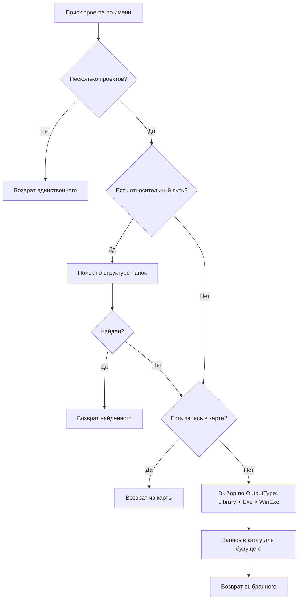

# Варианты решения проблемы дублирующихся имён проектов

## Постановка проблемы

При конвертации NuGet-пакетов в ссылки на проекты возникает конфликт, когда в индексируемой директории существует несколько проектов с одинаковым именем файла (например, `Xafari.Win.csproj`), но с разным содержимым и назначением.

### Пример конфликта

| Расположение | OutputType | GUID | Назначение |
|--------------|------------|------|------------|
| `Xafari\Xafari.Win\` | Library | `{51DC8273-...}` | Библиотека |
| `Xafari\Tools\Xafari.Win\` | WinExe | `{633CD317-...}` | Приложение |

---

## Вариант 1: Приоритет библиотек над приложениями

### Суть решения
При обнаружении проектов с одинаковым именем предпочитать проект с `OutputType=Library` вместо `WinExe` или `Exe`.

### Реализация

#### 1.1. Расширить структуру ProjectInfo

```csharp
/// <summary>
/// Информация о проекте для индекса
/// </summary>
public class ProjectInfo
{
    /// <summary>
    /// Полный путь к файлу проекта
    /// </summary>
    public string Path { get; set; }
    
    /// <summary>
    /// Тип вывода проекта (Library, Exe, WinExe)
    /// </summary>
    public string OutputType { get; set; }
    
    /// <summary>
    /// GUID проекта
    /// </summary>
    public string ProjectGuid { get; set; }
}
```

#### 1.2. Изменить индекс на список

```csharp
// Было:
private readonly Dictionary<string, string> _projectIndex;

// Станет:
private readonly Dictionary<string, List<ProjectInfo>> _projectIndex;
```

#### 1.3. Метод выбора лучшего проекта

```csharp
/// <summary>
/// Возвращает лучший проект из списка с одинаковыми именами
/// </summary>
public string FindBestProject(string projectName)
{
    if (!_projectIndex.TryGetValue(projectName, out var projects))
        return null;
    
    if (projects.Count == 1)
        return projects[0].Path;
    
    // Приоритет: Library > Exe > WinExe
    var priority = new[] { "Library", "Exe", "WinExe" };
    foreach (var outputType in priority)
    {
        var found = projects.FirstOrDefault(p => 
            p.OutputType?.Equals(outputType, StringComparison.OrdinalIgnoreCase) == true);
        if (found != null)
            return found.Path;
    }
    
    return projects[0].Path;
}
```

### Чтение OutputType из .csproj

```csharp
private ProjectInfo ReadProjectInfo(string projectPath)
{
    var doc = XDocument.Load(projectPath);
    var outputType = doc.Descendants("OutputType").FirstOrDefault()?.Value ?? "Library";
    var projectGuid = doc.Descendants("ProjectGuid").FirstOrDefault()?.Value;
    
    return new ProjectInfo
    {
        Path = projectPath,
        OutputType = outputType,
        ProjectGuid = projectGuid
    };
}
```

### Плюсы
- Простая эвристика, покрывает случай Xafari.Win
- Автоматическое разрешение без участия пользователя
- Минимальные изменения в коде

### Минусы
- Не работает, если оба проекта Library
- Требует чтения каждого .csproj при индексировании
- Может выбрать неправильный проект в других сценариях

---

## Вариант 2: Использование относительного пути как подсказки

### Суть решения
При разрешении ProjectReference использовать относительный путь для определения нужного проекта. Если в .csproj указан путь `..\Xafari.Win\Xafari.Win.csproj`, искать проект в соответствующей папке.

### Реализация

#### 2.1. Метод разрешения по пути

```csharp
/// <summary>
/// Находит проект по относительному пути
/// </summary>
private string FindProjectByRelativePath(string basePath, string relativePath)
{
    // Извлекаем имя папки из относительного пути
    // "..\Xafari.Win\Xafari.Win.csproj" -> "Xafari.Win"
    var pathParts = relativePath.Split(new[] { '/', '\\' }, StringSplitOptions.RemoveEmptyEntries);
    
    foreach (var part in pathParts)
    {
        if (part == ".." || part.EndsWith(".csproj"))
            continue;
            
        // Ищем проект в папке с таким именем
        var candidatePath = Path.Combine(basePath, part, $"{part}.csproj");
        if (File.Exists(candidatePath))
            return candidatePath;
    }
    
    return null;
}
```

#### 2.2. Интеграция в ResolveProjectPath

```csharp
private string ResolveProjectPath(string basePath, string relativePath, string solutionDir)
{
    // ... существующие стратегии ...
    
    // Новая стратегия: поиск по структуре папок
    var pathByFolder = FindProjectByRelativePath(basePath, relativePath);
    if (pathByFolder != null && File.Exists(pathByFolder))
        return pathByFolder;
    
    // ... fallback ...
}
```

### Плюсы
- Использует информацию из существующего ProjectReference
- Не требует изменения индекса
- Работает для случая Xafari.DockPanels.Win -> Xafari.Win

### Минусы
- Работает только при наличии относительного пути
- Не работает для PackageReference (там только имя пакета)

---

## Вариант 3: Расширенная карта соответствий

### Суть решения
Хранить в файле карты не только путь, но и метаданные проекта (GUID, OutputType). При конфликте использовать метаданные для выбора.

### Реализация

#### 3.1. Новый формат карты

```json
{
  "Xafari.Win": {
    "Path": "..\\..\\xafari\\Xafari\\Xafari.Win\\Xafari.Win.csproj",
    "OutputType": "Library",
    "ProjectGuid": "51DC8273-612E-4A08-95B8-5CFA1CCCDB05",
    "Aliases": ["Xafari.Win.Library"]
  },
  "Xafari.Win.App": {
    "Path": "..\\..\\xafari\\Xafari\\Tools\\Xafari.Win\\Xafari.Win.csproj",
    "OutputType": "WinExe",
    "ProjectGuid": "633CD317-8C68-4AD8-AD70-A311DCB1027E",
    "Aliases": ["Xafari.Win.WinExe", "Tools.Xafari.Win"]
  }
}
```

#### 3.2. Сервис карты

```csharp
public interface IMapFileService
{
    /// <summary>
    /// Получает проект по PackageId с учётом метаданных
    /// </summary>
    ProjectInfo GetProject(string packageId, string preferredOutputType = null);
    
    /// <summary>
    /// Регистрирует соответствие пакета проекту
    /// </summary>
    void Register(string packageId, ProjectInfo projectInfo);
}
```

### Плюсы
- Явное указание соответствия
- Сохраняется между запусками
- Поддерживает алиасы для разных имён пакетов

### Минусы
- Требует начальной настройки
- Сложнее структура файла карты

---

## Вариант 4: Интерактивное разрешение конфликтов

### Суть решения
При обнаружении конфликта показывать диалог пользователю для выбора нужного проекта.

### Реализация

#### 4.1. Детектор конфликтов

```csharp
/// <summary>
/// Возвращает список проектов с дублирующимися именами
/// </summary>
public Dictionary<string, List<ProjectInfo>> GetConflicts()
{
    return _projectIndex
        .Where(kvp => kvp.Value.Count > 1)
        .ToDictionary(kvp => kvp.Key, kvp => kvp.Value);
}
```

#### 4.2. Диалог выбора

```csharp
/// <summary>
/// Показывает диалог для выбора проекта при конфликте
/// </summary>
public string ShowConflictDialog(string projectName, List<ProjectInfo> candidates)
{
    // Показать список кандидатов с информацией:
    // - Путь к проекту
    // - OutputType
    // - GUID
    // Вернуть выбранный путь
}
```

### Плюсы
- Максимальная точность
- Пользователь контролирует выбор
- Можно запомнить выбор в карте

### Минусы
- Прерывает рабочий процесс
- Требует UI
- Не подходит для автоматической работы

---

## Вариант 5: Комбинированный подход (рекомендуется)

### Суть решения
Комбинация вариантов 1, 2 и 3 для максимальной надёжности.

### Алгоритм



### Реализация

```csharp
public string ResolveProject(string projectName, string relativePath = null, 
    string basePath = null, string solutionDir = null)
{
    var candidates = GetAllCandidates(projectName);
    
    if (candidates.Count == 0)
        return null;
    
    if (candidates.Count == 1)
        return candidates[0].Path;
    
    // Стратегия 1: По относительному пути
    if (!string.IsNullOrEmpty(relativePath) && !string.IsNullOrEmpty(basePath))
    {
        var found = FindByRelativePath(candidates, basePath, relativePath);
        if (found != null)
            return found.Path;
    }
    
    // Стратегия 2: Из карты
    if (_mapFileService.TryGet(projectName, out var mappedPath))
    {
        var found = candidates.FirstOrDefault(c => c.Path == mappedPath);
        if (found != null)
            return found.Path;
    }
    
    // Стратегия 3: По OutputType
    var selected = SelectByOutputType(candidates);
    
    // Сохраняем выбор в карте
    _mapFileService.AddOrUpdate(projectName, selected.Path, selected.OutputType);
    
    return selected.Path;
}
```

### Плюсы
- Максимальная точность
- Автоматическое разрешение в большинстве случаев
- Сохранение выбора для будущих запусков

### Минусы
- Наибольшая сложность реализации
- Требует изменений в нескольких компонентах

---

## Рекомендация

**Рекомендуется Вариант 5 (комбинированный подход)** с поэтапной реализацией:

1. **Этап 1**: Реализовать приоритет Library над WinExe (Вариант 1)
2. **Этап 2**: Добавить использование относительного пути (Вариант 2)
3. **Этап 3**: Расширить формат карты (Вариант 3)

Это позволит быстро закрыть проблему Xafari.Win и постепенно улучшать точность определения проектов.
