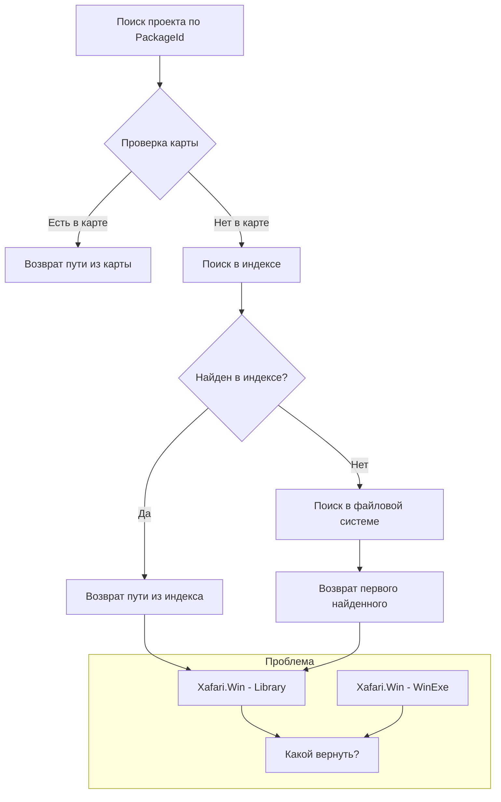

# Анализ источника проблемы с дублирующимися проектами

## Краткое описание проблемы

В репозитории xafari существуют два проекта с одинаковым именем `Xafari.Win`:
- **Библиотека**: `Xafari\Xafari.Win\` (OutputType: Library, GUID: `{51DC8273-...}`)
- **Приложение**: `Xafari\Tools\Xafari.Win\` (OutputType: WinExe, GUID: `{633CD317-...}`)

При работе конвертера возникает конфликт: невозможно однозначно определить, какой проект нужен.

---

## Источник проблемы в коде

### 1. ProjectIndexService - индексирование по имени

**Файл**: [`ProjectIndexService.cs`](src/NuGetToProjectReferenceConverter/Services/Indexing/ProjectIndexService.cs:76)

```csharp
// Строки 76-91
foreach (var projectFile in projectFiles)
{
    var projectName = Path.GetFileNameWithoutExtension(projectFile);

    // Если проект с таким именем уже есть, логируем дубликат
    if (_projectIndex.ContainsKey(projectName))
    {
        duplicateCount++;
        // Дубликат только логируется, но НЕ добавляется в индекс!
    }
    else
    {
        _projectIndex[projectName] = projectFile;
    }
}
```

**Проблема**: Индекс использует имя проекта как ключ. При обнаружении дубликата:
- Первый найденный проект попадает в индекс
- Второй проект игнорируется
- Порядок зависит от `Directory.GetFiles()` (алфавитный порядок папок)

### 2. FindProjectFileInFileSystem - возвращает первый найденный

**Файл**: [`SolutionService.cs`](src/NuGetToProjectReferenceConverter/Services/Solutions/SolutionService.cs:240)

```csharp
// Строки 240-246
foreach (var file in csprojFiles)
{
    var fileName = Path.GetFileNameWithoutExtension(file);
    if (fileName.Equals(projectName, StringComparison.OrdinalIgnoreCase))
    {
        // Возвращается ПЕРВЫЙ найденный файл
        return file;
    }
}
```

**Проблема**: Возвращается первый найденный файл без проверки типа проекта.

### 3. Отсутствие различения по GUID или OutputType

Конвертер не использует:
- **GUID проекта** - уникальный идентификатор
- **OutputType** - тип вывода (Library, WinExe, Exe)
- **AssemblyName** - может отличаться от имени файла

---

## Диаграмма потока данных при поиске проекта



---

## Варианты решения

### Вариант 1: Использовать GUID для разрешения конфликтов

**Идея**: При индексировании сохранять GUID проекта и использовать его для разрешения конфликтов.

**Изменения**:
1. Добавить структуру `ProjectInfo` с полями: Path, GUID, OutputType
2. Изменить индекс на `Dictionary<string, List<ProjectInfo>>`
3. При поиске учитывать контекст (например, тип ссылки)

**Плюсы**:
- Точное соответствие проектам
- GUID уникален глобально

**Минусы**:
- Требует чтения каждого .csproj для извлечения GUID
- Усложняет логику поиска

### Вариант 2: Приоритет библиотек над приложениями

**Идея**: При конфликте имён предпочитать проекты с OutputType=Library.

**Изменения**:
1. При индексировании определять OutputType
2. При конфликте выбирать Library вместо WinExe/Exe

**Плюсы**:
- Простой эвристический подход
- Покрывает случай Xafari.Win

**Минусы**:
- Не универсально (могут быть два проекта Library с одинаковым именем)
- Требует чтения .csproj

### Вариант 3: Использовать относительный путь из ProjectReference

**Идея**: При разрешении ProjectReference использовать относительный путь для определения нужного проекта.

**Контекст**: В `Xafari.DockPanels.Win.csproj` есть:
```xml
<ProjectReference Include="$(SolutionDir)Xafari.Win\Xafari.Win.csproj" />
```

Этот относительный путь указывает на библиотеку, а не на приложение.

**Изменения**:
1. Передавать контекст вызывающего проекта
2. Разрешать относительные пути относительно папки вызывающего проекта
3. Использовать относительный путь как подсказку

**Плюсы**:
- Использует существующую информацию
- Не требует изменения индекса

**Минусы**:
- Работает только для ProjectReference, не для PackageReference

### Вариант 4: Интерактивное разрешение конфликтов

**Идея**: При обнаружении конфликта спрашивать пользователя.

**Изменения**:
1. Определять конфликты при индексировании
2. Показывать диалог с выбором проекта
3. Запоминать выбор в карте

**Плюсы**:
- Максимальная точность
- Пользователь контролирует процесс

**Минусы**:
- Прерывает рабочий процесс
- Требует UI

### Вариант 5: Расширенная карта соответствий

**Идея**: Использовать дополнительные метаданные в карте.

**Формат карты**:
```json
{
  "Xafari.Win": {
    "Path": "..\\..\\xafari\\Xafari\\Xafari.Win\\Xafari.Win.csproj",
    "OutputType": "Library",
    "GUID": "51DC8273-612E-4A08-95B8-5CFA1CCCDB05"
  }
}
```

**Плюсы**:
- Явное указание нужного проекта
- Сохраняется между запусками

**Минусы**:
- Требует ручной настройки или первого запуска с выбором

---

## Рекомендуемое решение

**Комбинация вариантов 2 и 3**:

1. **При индексировании** определять OutputType и сохранять его
2. **При конфликте имён** предпочитать Library над WinExe/Exe
3. **При разрешении ProjectReference** использовать относительный путь как подсказку

Это покроет случай Xafari.Win и будет работать автоматически.

---

## План реализации

1. Изменить `ProjectIndexService` для хранения `List<ProjectInfo>` вместо одного пути
2. Добавить чтение OutputType из .csproj при индексировании
3. Реализовать метод `FindBestProject()` с учётом OutputType
4. Добавить логирование конфликтов для диагностики
5. Обновить карту для хранения метаданных
