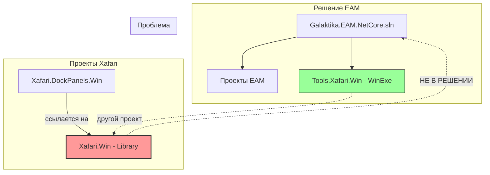

# Проблема с дублирующимися проектами Xafari.Win

## Описание проблемы

В репозитории xafari существуют **два разных проекта** с одинаковым именем `Xafari.Win`:

| Расположение | GUID | Тип вывода | Описание |
|--------------|------|------------|----------|
| `Xafari\Xafari.Win\` | `{51DC8273-612E-4A08-95B8-5CFA1CCCDB05}` | Library | Библиотека |
| `Xafari\Tools\Xafari.Win\` | `{633CD317-8C68-4AD8-AD70-A311DCB1027E}` | WinExe | Приложение |

---

## Что подключено в решении EAM

В файле `Galaktika.EAM.NetCore.sln` подключён только проект из папки `Tools\`:

```
Project("{FAE04EC0-301F-11D3-BF4B-00C04F79EFBC}") = "Xafari.Win", 
    "..\..\xafari\Xafari\Tools\Xafari.Win\Xafari.Win.csproj", 
    "{633CD317-8C68-4AD8-AD70-A311DCB1027E}"
```

Это исполняемый файл (WinExe), а не библиотека.

---

## Что ссылаются проекты xafari

Проекты xafari ссылаются на библиотеку `Xafari.Win` из корневой папки:

**Пример из `Xafari.DockPanels.Win.csproj`:**
```xml
<ProjectReference Include="..\Xafari.Win\Xafari.Win.csproj" />
```

Это ссылка на `Xafari\Xafari.Win\` (библиотеку), а не на `Tools\Xafari.Win\` (приложение).

---

## Возникающая ошибка

```
error NU1105: Не удалось найти сведения о проекте для 
"D:\galprj\test_fix\analysis\xafari\Xafari\Xafari.Win\Xafari.Win.csproj". 
Если вы используете Visual Studio, причина может заключаться в том, что проект 
выгружен или не является частью текущего решения.
```

**Причина:** Проект `Xafari.DockPanels.Win` ссылается на библиотеку `Xafari.Win`, но она не включена в решение EAM. В решении есть только исполняемый файл из `Tools\Xafari.Win\` — это другой проект с другим GUID.

---

## Диаграмма проблемы



---

## Вывод

Проекты xafari используют библиотеку `Xafari\Xafari.Win\`, но в решении EAM подключён исполняемый файл `Tools\Xafari.Win\`. Это разные проекты с разными GUID и типами вывода. Библиотека не включена в решение, что вызывает ошибку сборки.
